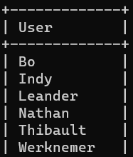

# Database 

There are two databases, a warehouse database and an order database. The warehouse database keeps track of which and how many products are stored on the shelves. It is updated when an order is placed in the order database. If the products go below minimum number of products, new products will be added automatically.

## Content
1. [MagazijnDatabase](#magazijndatabase)
2. [OrderDatabase](#orderdatabase)
3. [php](#php)
4. [Databaseconfiguratie](#databaseconfiguratie)
5. [Functies](#functies)
    - [voegRekToe](#functie-om-een-rek-toe-te-voegen)
    - [voegProductToe](#functie-om-een-product-toe-te-voegen)
    - [plaatsOrder](#functie-om-een-order-toe-te-voegen)
6. [Server](#server)
    - [Users](#users)

<br/>
<br/>
<br/>

# MagazijnDatabase en OrderDatabase


## MagazijnDatabase

1. **Databasecreation**: The code starts by creating the database named `MagazijnDatabase`. If the database already exists, it is skipped.

    ```sql
    CREATE DATABASE IF NOT EXISTS MagazijnDatabase;
    USE MagazijnDatabase;
    ```

2. **Rekken Tabel**: A table `Rek` is created to store information about the racks, including ID, name, number of products, maximum capacity and whether the rack is empty.

    ```sql
    CREATE TABLE IF NOT EXISTS Rek (
        RekID INT PRIMARY KEY,
        RekName VARCHAR(255) NOT NULL,
        AantalProducten INT DEFAULT 0,
        MaxAantalProducten INT DEFAULT 10,
        IsEmpty BOOLEAN DEFAULT TRUE
    );
    ```

3. **Producten Tabel**: A table `Product` is created to store information about the products, including ID, name, rack ID, stock, minimum stock and whether the product is empty. There is also an external key (FOREIGN KEY) to the `Rek` table.

    ```sql
    CREATE TABLE Product (
        ProductID INT PRIMARY KEY,
        ProductNaam VARCHAR(255),
        RekID INT,
        Stock INT DEFAULT 0,
        MinVoorraad INT DEFAULT 5,
        IsEmpty BOOLEAN DEFAULT TRUE,
        FOREIGN KEY (RekID) REFERENCES Rek(RekID)
    );
    ```

4. **Procedure VoegProductToe**: A stored procedure is created to facilitate adding products to the database.

    ```sql
    DELIMITER //
    CREATE PROCEDURE VoegProductToe(
        IN p_ProductID INT,
        IN p_ProductNaam VARCHAR(255),
        IN p_RekID INT,
        IN p_Stock INT
    )
    ```

## Orderdatabase

1. **Databasecreatie voor Orders**: A separate database called `OrderDatabase` is created for managing orders.

    ```sql
    CREATE DATABASE IF NOT EXISTS OrderDatabase;
    USE OrderDatabase;
    ```

2. **Ordertabel**: A table `OrderTable` is created to store information about the orders, including order ID, rack ID, product ID, product name and quantity. There are external keys to both the `Rek` and `Product` tables.

    ```sql
    CREATE TABLE OrderTabel (
        OrderID INT PRIMARY KEY,
        RekID INT,
        ProductID INT,
        ProductNaam VARCHAR(255),
        Hoeveelheid INT,
        FOREIGN KEY (RekID) REFERENCES Rek(RekID),
        FOREIGN KEY (ProductID) REFERENCES Product(ProductID)
    );


<br/>
<br/>
<br/>

# php

## Databaseconfiguratie

The code uses five variables to configure the database connection:

- `$servername`: The name of the server.
- `$username`: The username for the databaseconnection.
- `$password`: The password for the databaseconnection.
- `$dbname_rek`: The database name for rack data.
- `$dbname_order`: The database name for order data.


## Functies

### Function to add a rek

- **Name**: `voegRekToe`
- **Parameters**: `$rekID` (ID of the rack), `$rekNaam` (name of the rack)
- **Functionality**: Adds a new rack to the database with specified ID and name.

### Function to add a product

- **Name**: `voegProductToe`
- **Parameters**: `$productID` (ID of the product), `$productNaam` (name of the product), `$rekID` (ID of the rek), `$Stock` (stock of the product), `$MinVoorraad` (minimum stock)
- **Functionality**: Adds a new product to the specified rack. Automatically manages adding products to other racks if the current rack is full.

### Function to add an order

- **Name**: `plaatsOrder`
- **Parameters**: `$orderID` (ID of the order), `$rekID` (ID of the rek), `$productID` (ID of the product), `$hoeveelheid` (quantity of the product in the order)
- **Functionality**: Places a new order in the database. Updates the product's stock and automatically orders the product if the stock falls below the minimum stock.

# Server
The database is on mariadb's server, allowing the website and the opc-ua server to connect and get data from the database.
To connect, there are 5 variables to configure a connection:
- **Server_name**: `magazijnServer`
- **Host**: `192.168.1.222`
- **Db**: `MagazijnDatabase`
- **Username**: Depending on which user wants to connect
- **Password**: Depending on which user wants to connect

## Users
Several users can be created. The number of privileges and permissions for each user can be decided separately.
For example the foreman is able to add products or delete products from the database. While the workers are only able to see the contents of the database and are not able to change anything in the database. 
<br/>

## Auteurs
- **[Bo Mengels](https://github.com/12003586)** - _CONTRIBUTOR_ - 


