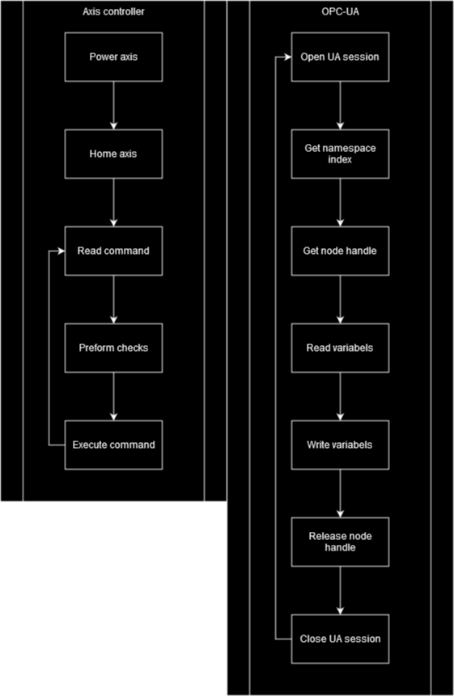

# Storage Controller

# I/O (OPC-UA)
## Inputs
* Import / Export
* Storage location
* Reset
* Power up/down
* Emergency stop
## Outputs
* Ready
* Busy
* Error
* Error id
# Scenarios
### Startup
* The PLC wil power the X, Y, and Z axis
* The X, Y, and Z axis are homed
* The PLC waits for a command
### Move from input to storage
* A command is send to the PLC using OPC-UA
* The PLC reads the command
* The command is send to the storage controller function block
* The controller will move the loader to the input
* The product is picked up
* The loader moves to the storage location
* The product is stored
* The loader moves to the idle position
### Move from storage to output
* A command is send to the PLC using OPC-UA
* The PLC reads the command
* The command is send to the storage controller function block
* The controller will move the unloader to the storage location
* The product is taken out of storage
* The unloader moves to the export location
* The product is placed in the export location
* The unloader moves to the idle position
### Move command is invalid
* A command is send to the PLC using OPC-UA
* The PLC reads the command
* The command is invalid and ignored
### PLC is in error state
* A command is send to the PLC using OPC-UA
* The PLC is in an error state and does not execute new commands
### Import is empty but command is send
* A command is send to the PLC using OPC-UA
* The PLC reads the command
* The PLC can not execute the command and enters an error state
### Export is full but command is send
* A command is send to the PLC using OPC-UA
* The PLC reads the command
* The PLC can not execute the command and enters an error state
### (Un)loader gets stuck
* A command is being executed
* Something prevent movement of the (un)loader
* The PLC stops movements but keeps power
* The PLC enters an error state
### Move command is send but PLC is already executing
* A command is send to the PLC using OPC-UA
* The PLC reads the command
* The previous command is executed until finished
* Power is removed from X, Y, and Z axis
* The PLC enter an error state
### Emergency stop is pushed
#### The (un)loader is in idle position
* Power is removed from X, Y, and Z axis
* PLC enter error state
#### The (un)loader is moving
* Movement is stopped
* Power is not removed to prevent unwanted movement
* PLC enter error state