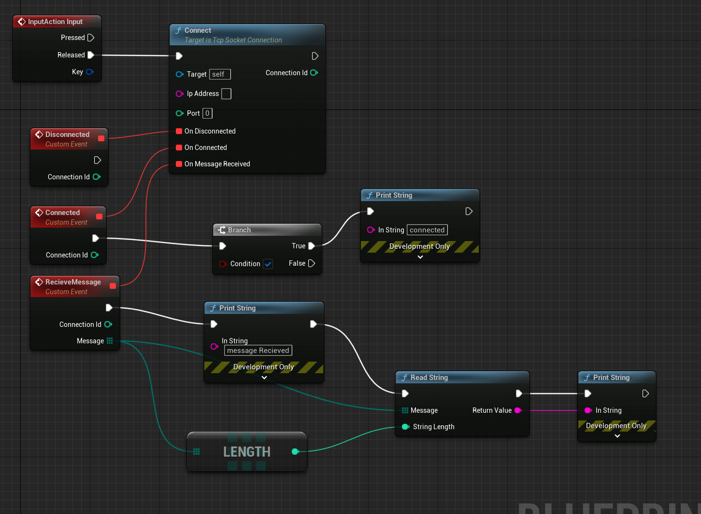

# Industry 4.0 Integration: Collaborative Visualization in Unreal Engine 5

## Harnessing Unreal Engine 5 for Industry 4.0

In the context of Industry 4.0, where interconnected systems and data-driven decision-making are paramount, Unreal Engine 5 emerges as a transformative tool for collaborative visualization. Here, we explore how Unreal Engine 5 seamlessly integrates with Industry 4.0 principles to create advanced visualizations and virtualizations.

## **Immersive Training and Simulation**

### **Chaos Physics for Realistic Simulations**

In the Industry 4.0 landscape, where the ability to simulate and train in a virtual environment is crucial, Unreal Engine 5's Chaos Physics provides realistic simulations of physical interactions. This is invaluable for training operators and simulating scenarios to optimize manufacturing processes or troubleshoot potential issues before they occur in the real world.

### **AR and VR for Enhanced Training**

The integration of augmented reality (AR) and virtual reality (VR) capabilities in Unreal Engine 5 enhances training scenarios. Industries can deploy AR/VR solutions for hands-on training, allowing workers to familiarize themselves with new equipment or processes in a controlled virtual environment before interacting with physical machinery.

## **Conclusion**

Unreal Engine 5 seamlessly integrates with Industry 4.0 principles, providing a platform for collaborative visualization that goes beyond aesthetics. Its real-time collaboration features, data-driven capabilities, and immersive training simulations position it as a pivotal tool for industries navigating the complexities of Industry 4.0, facilitating informed decision-making, efficient training, and optimized manufacturing processes.

## **My Work**
### **The Warehouse**

Welcome to the virtual warehouse workspace, a dynamic environment where an array of cabinets is meticulously organized with various materials. This digital haven serves as the hub for simulating and visualizing potential rearrangements of both cabinets and the materials they house. The seamless integration of cutting-edge technology allows for a comprehensive exploration of different configurations and optimizations.

Within this virtual realm, the intricate interplay between cabinets and materials unfolds, offering a simulated canvas for experimenting with logistical possibilities. This simulation not only streamlines the ordering of cabinets and materials but also enhances efficiency by providing a visual representation of potential changes.

Facilitating the bridge between this virtual realm and the tangible world is a TCP connection blueprint. This blueprint acts as the conduit for the exchange of data, enabling the seamless flow of information between the digital simulation and the real-world warehouse setting. Through this robust communication framework, data is received and sent with precision, ensuring that the virtual workspace remains closely aligned with the dynamic demands of the physical environment.

In essence, the virtual warehouse workspace serves as a powerful tool for strategic planning and logistical foresight, empowering users to make informed decisions by virtually manipulating the organization of cabinets and materials. The incorporation of a robust TCP connection blueprint further exemplifies the commitment to real-world applicability, ensuring that the insights gained in the virtual realm seamlessly translate into tangible improvements in warehouse efficiency and organization.

### **Communication blueprint**

