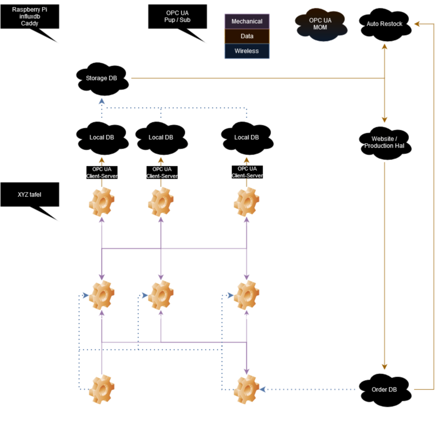

Magazijn

---

* Import
Products that need to be stocked are placed here.

* Picker
Moves products between Import/Storage/Export.

* Rek
Product storage.

* Local DB
Keeps track of all products in linked storages.

* Storage DB
Keeps track of all products.

* Auto Restock
Places orders to resupply any product shortage.

* Website
Gives an overview of all stored products, can be used for manual export of products, and can be used to place manual orders for resupply.

* Production Hal
Processing request from the production hal to export materials needed by the machines.

* Order DB
Keeps track of all pending orders

* OPC UA MOM
Message Oriented Middleware, is used for the Pup / Sub functionality of OPC AU. 

---

The storage can be simulated using the XYZ-table, this can be done by dividing the board in storage locations, an import location, and an export location. The head can then be moved between these places. It would be possible to 3D print a header and 'bulk products' and move these around.

For the databases influxdb is the current database of choice, this can run on a Raspberry Pi, multiple can run on one to simulate multiple separate databases.

The website can also be hosted on the same Raspberry Pi as the databases to keep hardware requirements for the simulation lower. To host the website Caddy is the primary candidate.

Communication between all parts is done by OPC UA, using either Pup / Sub or Client-Server.

